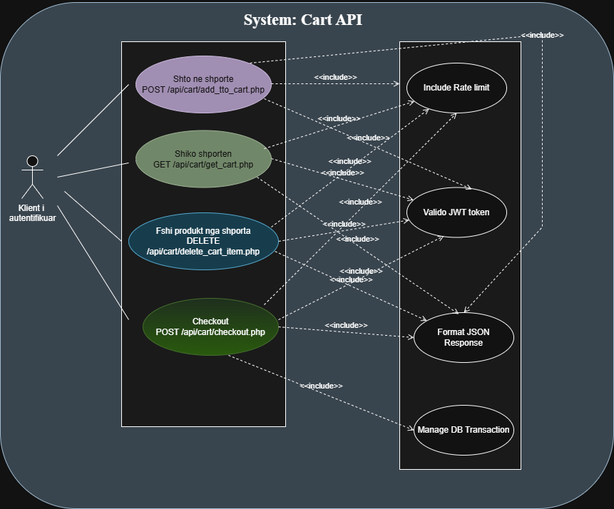
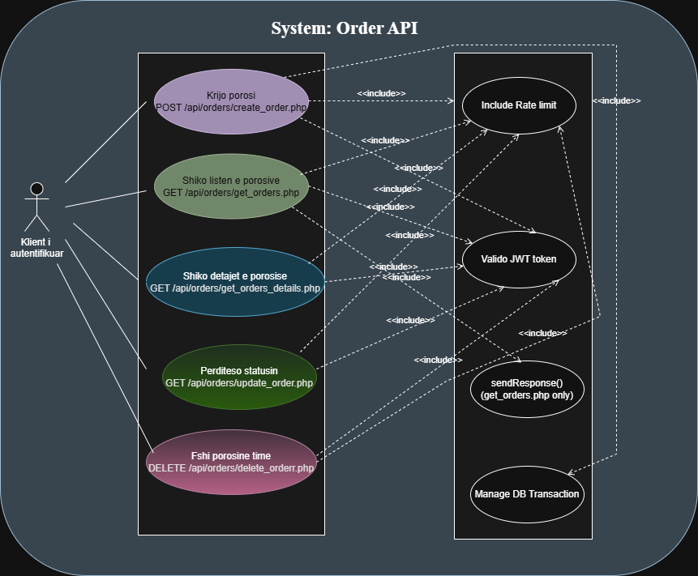
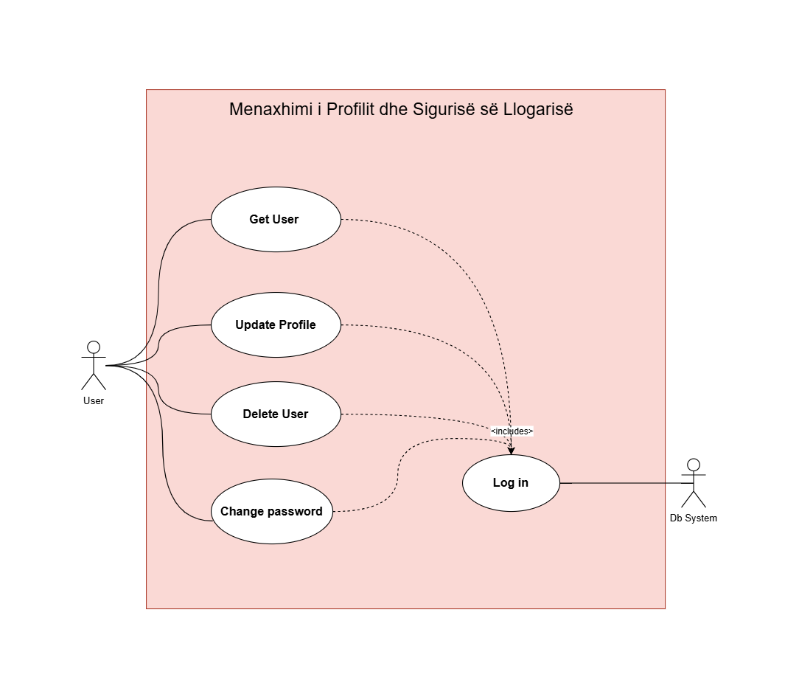
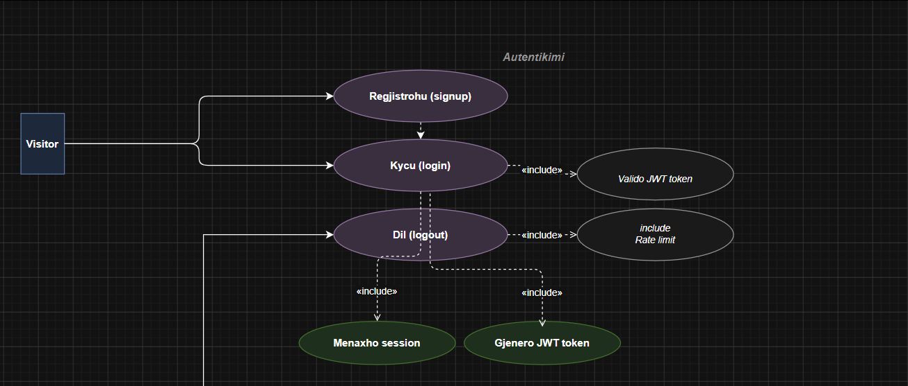
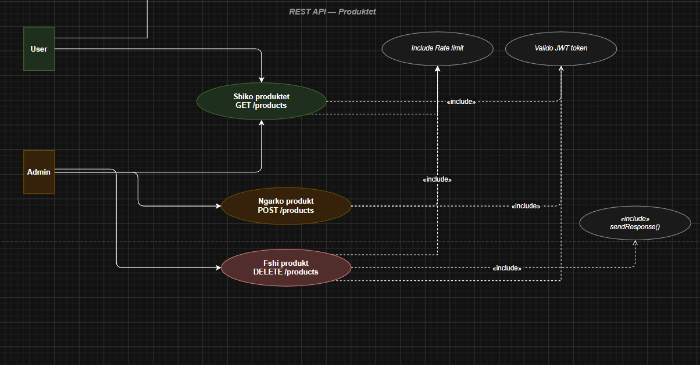

## 1. Përshkrimi i Projektit
Projekti konsiston në zhvillimin e një platforme elektronike (E-commerce) të quajtur "Lovelyz Skincare". Ky aplikacion u vjen në ndihmë përdoruesve për të shfletuar dhe blerë produkte kozmetike online, si dhe menaxherëve të sistemit për të mbajtur nën kontroll inventarin dhe porositë e klientëve.

## 2. Aktorët e Sistemit (Actors)
### Klienti (Client)

* Regjistrohet dhe identifikohet në sistem
* Menaxhon profilin personal
* Shfleton produktet
* Shton produkte në cart
* Kryen porosi
* Merr asistencë nga chatbot

### Administratori (Admin)

* Menaxhon produktet (CRUD)
* Menaxhon përdoruesit
* Monitoron porositë
* Ka akses të autorizuar në endpoint-et administrative

## 3. Arkitektura e Sistemit
Sistemi bazohet në arkitekturën Klient-Server (Client-Server Architecture) dhe funksionon si më poshtë:

Frontend (Klienti): Ndërfaqja e përdoruesit e ndërtuar me teknologji web, e cila komunikon me serverin përmes protokollit HTTP (Localhost). Ajo konsumon API-të për të shfaqur të dhënat në mënyrë dinamike dhe menaxhon në mënyrë të sigurt token-at e sesionit.

Backend (Serveri): Logjika e biznesit është zhvilluar me Pure PHP, duke ndërtuar një arkitekturë REST API. Për ambientin lokal është përdorur paketa XAMPP (Web Server Apache). Communication midis Frontend dhe Backend sigurohet përmes JWT (JSON Web Tokens).

Database (Baza e të Dhënave): Si sistem menaxhimi është përdorur MySQL (RDBMS). Modeli përbëhet nga entitetet: Users, Products, Orders dhe Order Details.

Siguria: Autentikimi bazohet në role (RBAC). Fjalëkalimet ruhen me hashing (bcrypt). Pikat fundore (Endpoints) mbrohen nga sulmet Brute-Force përmes mekanizmit Rate-Limiting (tabela rate_limits).

# 4. Kërkesat e Sistemit

## 4.1 Kërkesat Funksionale (Functional Requirements - FR)

### Menaxhimi i Autentikimit dhe Sigurisë

**FR-AUTH-01 (Regjistrimi i Përdoruesit)**
Sistemi duhet t’i lejojë një përdoruesi të krijojë një llogari të re përmes endpoint-it `/api/register`, duke ruajtur të dhënat në databazë dhe duke gjeneruar JWT Token.

**FR-AUTH-02 (Login i Përdoruesit)**
Sistemi duhet të lejojë autentikimin përmes endpoint-it `/api/login`, duke validuar email dhe password dhe duke kthyer JWT Token bashkë me rolin e përdoruesit (`admin` ose `client`).

**FR-AUTH-03 (Role Based Access Control - RBAC)**
Sistemi duhet të kufizojë aksesin sipas roleve. Vetëm administratori mund të aksesojë endpoint-et administrative dhe panelin e menaxhimit.

**FR-AUTH-04 (Mbrojtja nga Brute Force)**
Sistemi duhet të implementojë Rate Limiting për të kufizuar tentativat e shumta të login-it dhe për të parandaluar sulmet brute-force.

---

### Menaxhimi i Profilit të Përdoruesit

**FR-USER-01 (Leximi i Profilit)**
Sistemi duhet të marrë të dhënat aktuale të klientit të kyçur nga tabela `users` përmes endpoint-it `GET /api/clients/get_user` dhe t’i shfaqë ato në ndërfaqen grafike.

**FR-USER-02 (Përditësimi i Profilit)**
Sistemi duhet t’i lejojë përdoruesit të përditësojë emrin, mbiemrin dhe email-in përmes endpoint-it `PUT/POST /api/clients/update_user`.

**FR-USER-03 (Ndryshimi i Fjalëkalimit)**
Sistemi duhet të verifikojë password-in aktual dhe të lejojë ndryshimin e password-it përmes hashing me bcrypt.

**FR-USER-04 (Fshirja e Llogarisë)**
Sistemi duhet t’i lejojë përdoruesit ose administratorit të fshijë një profil ekzistues përmes endpoint-it `DELETE /api/clients/delete_user`.

---

### Menaxhimi i Produkteve

**FR-PRODUCT-01 (Shfaqja e Produkteve)**
Sistemi duhet të marrë listën e produkteve përmes endpoint-it `GET /api/products` dhe t’i shfaqë ato në frontend me emër, çmim dhe imazh.

**FR-PRODUCT-02 (Shtimi i Produktit)**
Administratori duhet të ketë mundësi të shtojë produkte të reja përmes endpoint-it `POST /api/upload_product`.

**FR-PRODUCT-03 (Përditësimi i Produktit)**
Administratori duhet të ketë mundësi të modifikojë informacionin e produkteve ekzistuese.

**FR-PRODUCT-04 (Fshirja e Produktit)**
Administratori duhet të ketë mundësi të fshijë produkte nga databaza përmes endpoint-it `DELETE /api/delete_product`.

---

### Menaxhimi i Porosive dhe Shportës

**FR-ORDER-01 (Shtimi në Cart)**
Klienti duhet të ketë mundësi të shtojë produkte në shportën virtuale (Cart).

**FR-ORDER-02 (Checkout / Krijimi i Porosisë)**
Sistemi duhet të krijojë një porosi përmes endpoint-it `POST /api/orders`, duke ruajtur të dhënat në tabelat `orders` dhe `order_details`.

**FR-ORDER-03 (Shfaqja e Detajeve të Porosisë)**
Sistemi duhet të marrë detajet e porosive përmes SQL JOIN ndërmjet tabelave përkatëse.

---

### Chatbot dhe Asistenca ndaj Klientit

**FR-CHATBOT-01 (Asistencë për Përdoruesin)**
Sistemi duhet të përfshijë një chatbot për asistencë klienti, i cili ndihmon përdoruesit në navigim dhe pyetje bazë rreth produkteve.

---

## 4.2 Kërkesat Jo-Funksionale (Non-Functional Requirements - NFR)

### Siguria

**NFR-SEC-01 (Validimi në Server)**
Të gjitha të dhënat e dërguara nga frontend-i duhet të validohen në backend (PHP). Input-et e pavlefshme duhet të kthejnë status `400 Bad Request`.

**NFR-SEC-02 (Autorizimi me JWT)**
Identiteti i përdoruesit nuk duhet të merret nga URL-ja, por nga JWT Token i dërguar në HTTP Header.

**NFR-SEC-03 (Hashing i Password-it)**
Të gjitha password-et duhet të ruhen të hash-uara me algoritmin bcrypt.

**NFR-SEC-04 (Prepared Statements / PDO)**
Të gjitha query-t SQL duhet të përdorin Prepared Statements (PDO) për të shmangur SQL Injection.

**NFR-SEC-05 (Rate Limiting)**
Serveri duhet të kufizojë tentativat e login-it dhe të kthejë status `429 Too Many Requests` pas tentativave të shumta të dështuara.

### Performanca

**NFR-PERF-01**
API-t duhet të ofrojnë kohë përgjigjeje të shpejtë për operacionet CRUD.

### Përdorshmëria (Usability)

**NFR-UI-01**
Ndërfaqja duhet të jetë responsive dhe funksionale si në desktop ashtu edhe në mobile.

### Disponueshmëria

**NFR-SYS-01**
Sistemi duhet të funksionojë në ambient lokal përmes Apache/MySQL në XAMPP.

## 5. Use Cases / Skenarët Kryesorë të Përdorimit

### UC-03 – Menaxhimi i Shportës (Cart)
 
**Aktori:** Klienti
 
**Përshkrimi:**  
Klienti mund të shtojë produkte në shportë, të shikojë përmbajtjen e saj, të kryejë checkout dhe të fshijë artikuj nga shporta.
 
**Main Flow:**  
1. Klienti shfleton produktet dhe klikon "Shto në shportë".  
2. Sistemi shton produktin në tabelën `cart` përmes `POST /api/cart/add_to_cart.php`.  
3. Klienti hap faqen e shportës — sistemi merr artikujt përmes `GET /api/cart/get_cart.php`.  
4. Klienti mund të fshijë një artikull përmes `DELETE /api/cart/delete_cart_item.php`.  
5. Klienti klikon "Checkout" — sistemi krijon porosinë përmes `POST /api/cart/checkout.php` dhe pastron shportën.

#### Use Case Diagram / Screenshot
 

### UC- 03

### UC-04 – Menaxhimi i Porosive (Orders)
 
**Aktori:** Klienti
 
**Përshkrimi:**  
Klienti mund të krijojë porosi, të shikojë historikun e porosive dhe detajet e tyre, si dhe të anulojë një porosi nëse statusi lejon.
 
**Main Flow:**  
1. Pas checkout-it, sistemi krijon porosinë përmes `POST /api/orders/create_order.php`.  
2. Klienti hap faqen "Porositë e Mia" — sistemi merr të gjitha porositë përmes `GET /api/orders/get_orders.php`.  
3. Klienti klikon një porosi për të parë detajet përmes `GET /api/orders/get_orders_details.php?order_id=X`.  
4. Nëse statusi është `Pending`, klienti mund të anulojë porosinë përmes `PUT /api/orders/update_order.php`.  
5. Nëse statusi është `Shipped`, butoni "Cancel" bëhet i padisponueshëm.  
6. Klienti ose administratori mund të fshijë porosinë përmes `DELETE /api/orders/delete_order.php`.

#### Use Case Diagram / Screenshot
 

### UC- 04

### UC-05 – Menaxhimi i Profilit dhe Sigurisë së Llogarisë

**Aktori:** Klienti

**Përshkrimi:**  
Përdoruesi mund të shohë, përditësojë ose fshijë të dhënat e profilit të tij.

**Main Flow:**  
1. Përdoruesi hap faqen “Profili Im”.  
2. Sistemi merr të dhënat e përdoruesit.  
3. Përdoruesi ndryshon të dhënat ose password-in.  
4. Sistemi ruan ndryshimet.

#### Use Case Diagram / Screenshot

## 5. Use cases / skenarët kryesorë të përdorimit
### UC- 05

## UC-06 Autentikimi (Login / Signup / Logout)
**Aktori:** Visitor, User  
**Përshkrimi:** Visitatori mund të krijojë llogari të re ose të kyçet me kredenciale ekzistuese. Pas autentikimit sistemi gjeneron një token JWT që përdoret për të aksesuar faqet e mbrojtura.

**Main Flow:**
1. Visitatori plotëson formularin e regjistrimit — sistemi krijon userin në DB përmes `POST /includes/signup.inc.php`.
2. Sistemi nis session të ri dhe ridrejton tek faqja e loginit.
3. Useri plotëson email dhe fjalëkalim — sistemi verifikon kredencialet përmes `POST /includes/auth/login.php`.
4. Sistemi gjeneron token JWT dhe e ruan në `localStorage` të browserit.
5. Useri ridrejtohet tek `index.html` ose `admin.html` sipas rolit.
6. Useri klikon "Sign Out" — sistemi fshin token-in nga `localStorage` dhe pastron session-in përmes `includes/logout.inc.php`.

---

## UC-07 – REST API Menaxhimi i Produkteve
**Aktori:** User, Admin  
**Përshkrimi:** Useri mund të shikojë produktet e disponueshme. Admini mund të ngarkojë produkte të reja me imazh dhe të fshijë produkte ekzistuese. Të gjitha kërkeset kalojnë nëpër validim JWT dhe rate limiting.

**Main Flow:**
1. Useri ose Admini dërgon kërkesë me token JWT në header `Authorization: Bearer`.
2. Sistemi verifikon token-in përmes `validateJWT()` — nëse është i pavlefshëm kthen `401 Unauthorized`.
3. Sistemi kontrollon rate limiting përmes `rateLimit()` — nëse kalohen 30 kërkesa në 60 sekonda kthen `429 Too Many Requests`.
4. **GET** — Useri merr listën e produkteve përmes `GET /api/products/get_products.php` — sistemi kthen array JSON me të gjitha produktet.
5. **POST** — Admini ngarkon produkt të ri përmes `POST /api/products/upload_products.php` me `multipart/form-data` — sistemi ruan imazhin në `assets/images/` dhe të dhënat në DB.
6. **DELETE** — Admini fshin një produkt përmes `DELETE /api/products/delete_products.php` me `product_id` në body JSON — sistemi fshin rekordin nga DB.
7. Sistemi kthen përgjigje JSON përmes `sendResponse()` me status kod të saktë.

