# Test Report

## Skenari 1: Autentikimi dhe Siguria

## TS-01 — Login (Autentikimi i përdoruesit)

| Fusha    | Detaji                                                        |
|----------|---------------------------------------------------------------|
| Backend  | POST /includes/auth/login.php — Verifikon email + fjalëkalim  |
| Frontend | Token JWT ruhet në localStorage, ridrejton tek index.html     |
| Statusi  | Passed 
|
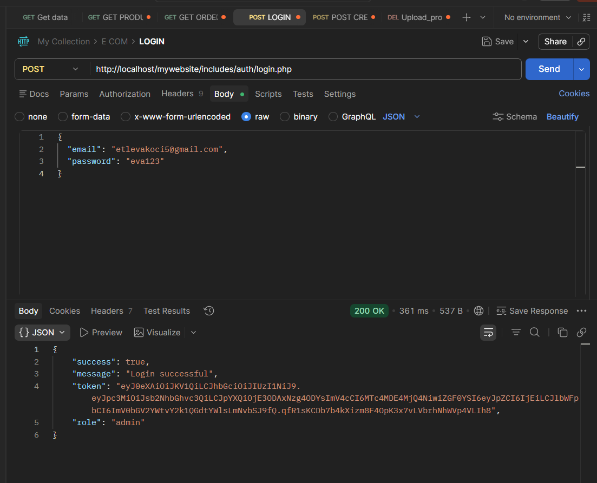

## TS-02 — Signup (Regjistrimi i përdoruesit të ri)

| Fusha    | Detaji                                                        |
|----------|---------------------------------------------------------------|
| Backend  | POST /includes/signup.inc.php — INSERT user i ri në DB        |
| Frontend | Ridrejton tek index.php pas regjistrimit të suksesshëm        |
| Statusi  | Passed                                                     |

## TS-03 — Rate Limiting

| Fusha    | Detaji                                                        |
|----------|---------------------------------------------------------------|
| Backend  | Pas 30 kërkesave brenda 60 sekondave kthen 429                |
| Frontend | —                                                             |
| Statusi  | Passed   

## Skenari 2: Menaxhimi i Produkteve

## TS-04 — GET Produktet

| Fusha    | Detaji                                                        |
|----------|---------------------------------------------------------------|
| Backend  | GET /api/products/get_products.php — Kthen listën e produkteve|
| Frontend | Produktet shfaqen në faqen kryesore                           |
| Statusi  | Passed                                                     |

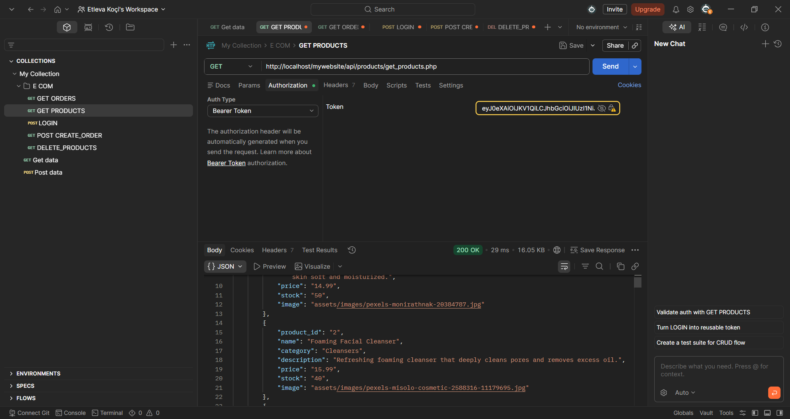

## TS-05 — Upload Produkt

| Fusha    | Detaji                                                        |
|----------|---------------------------------------------------------------|
| Backend  | POST /api/products/upload_products.php — multipart/form-data  |
| Frontend | Admini shton produkt nga paneli, imazhi ruhet në assets/      |
| Statusi  | Passed                                                     |

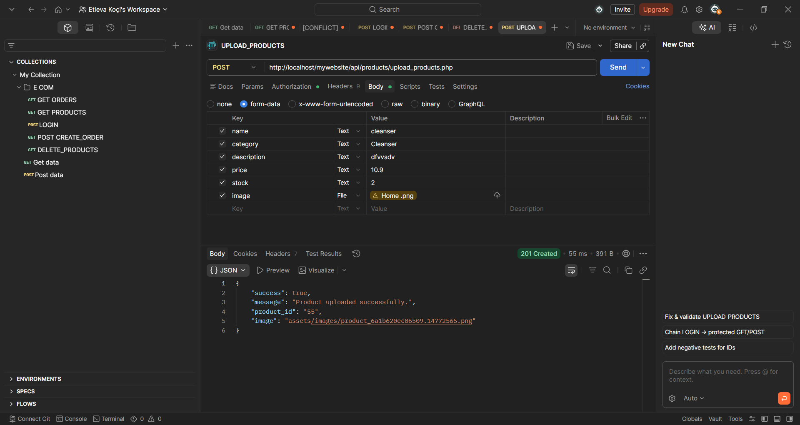

---

## TS-06 — Delete Produkt

| Fusha    | Detaji                                                        |
|----------|---------------------------------------------------------------|
| Backend  | DELETE /api/products/delete_products.php — Fshin nga DB       |
| Frontend | Admini zgjedh produktin dhe konfirmon fshirjen                |
| Statusi  | Passed                                                     |

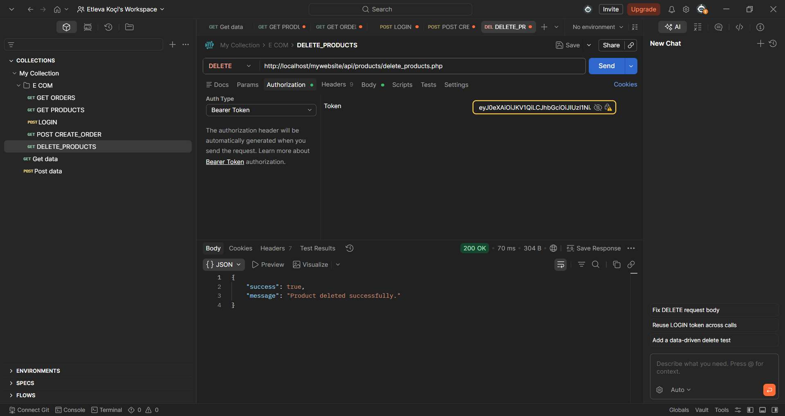

## Skenari 3: Menaxhimi i Shportës (Cart)
 
### TS-07 — Add to Cart (Shtimi i artikullit në shportë)
| Fusha | Detaji |
|---|---|
| Backend | POST /api/cart/add_to_cart.php — INSERT ose UPDATE quantity |
| Frontend | Shfaqet njoftimi "Artikulli u shtua në shportë" |
| Statusi | Passed |
 
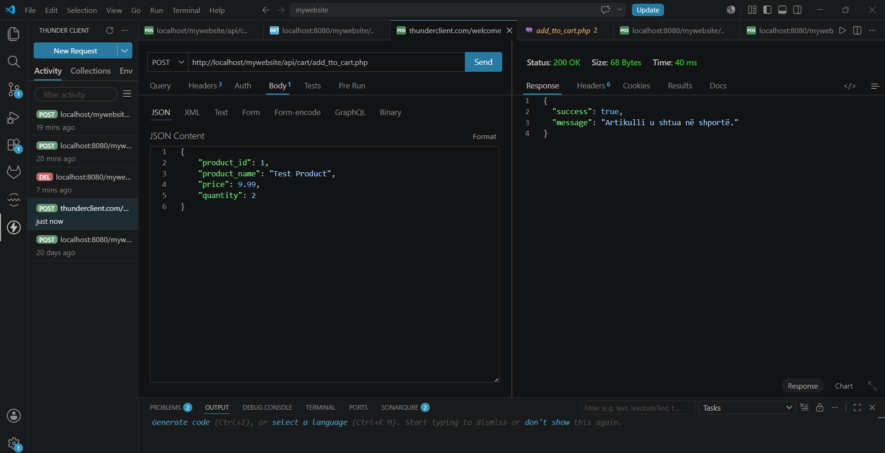
 
---
 
### TS-08 — View Cart (Shikimi i shportës)
| Fusha | Detaji |
|---|---|
| Backend | GET /api/cart/get_cart.php — JOIN me tabelën products për imazhin |
| Frontend | Liston artikujt me emër, çmim dhe sasi në UI |
| Statusi | Passed |
 
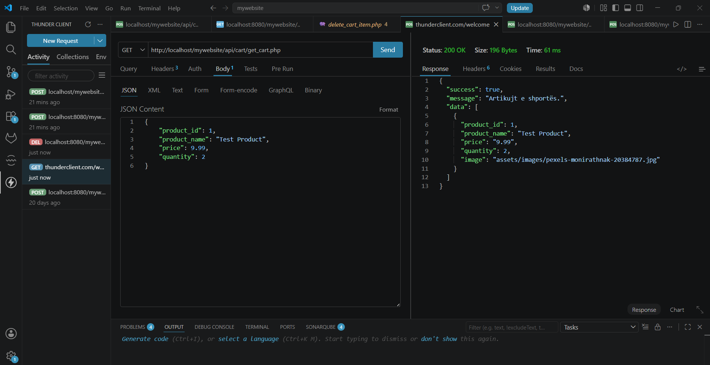
 
---
 
### TS-09 — Checkout (Konfirmimi i blerjes)
| Fusha | Detaji |
|---|---|
| Backend | POST /api/cart/checkout.php — krijon porosinë dhe pastron shportën |
| Frontend | Redirect te faqja e konfirmimit pas pagesës |
| Statusi | Passed |
 
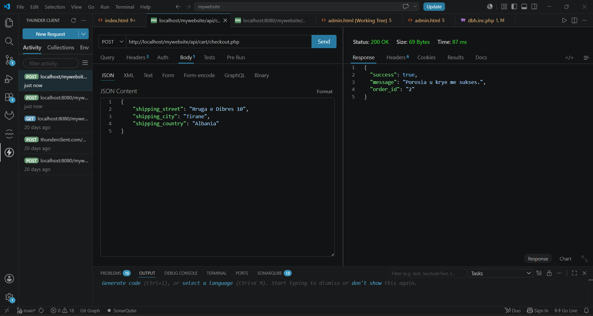
 
---
 
### TS-10 — Delete Cart Item (Fshirja e artikullit nga shporta)
| Fusha | Detaji |
|---|---|
| Backend | DELETE /api/cart/delete_cart_item.php?cart_id=X |
| Frontend | Artikulli hiqet nga lista dhe totali përditësohet |
| Statusi | Passed |
 
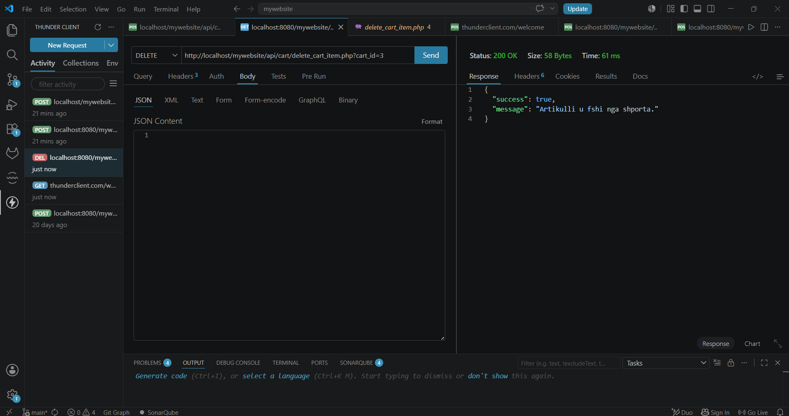
 
---
 
## Skenari 4: Menaxhimi i Porosive (Orders)
 
### TS-11 — Create Order (Krijimi i porosisë)
| Fusha | Detaji |
|---|---|
| Backend | POST /api/orders/create_order.php — Transactional INSERT (Orders & Details) |
| Frontend | Redirect te "Success Page" dhe pastrimi i shportës |
| Statusi | Passed |
 
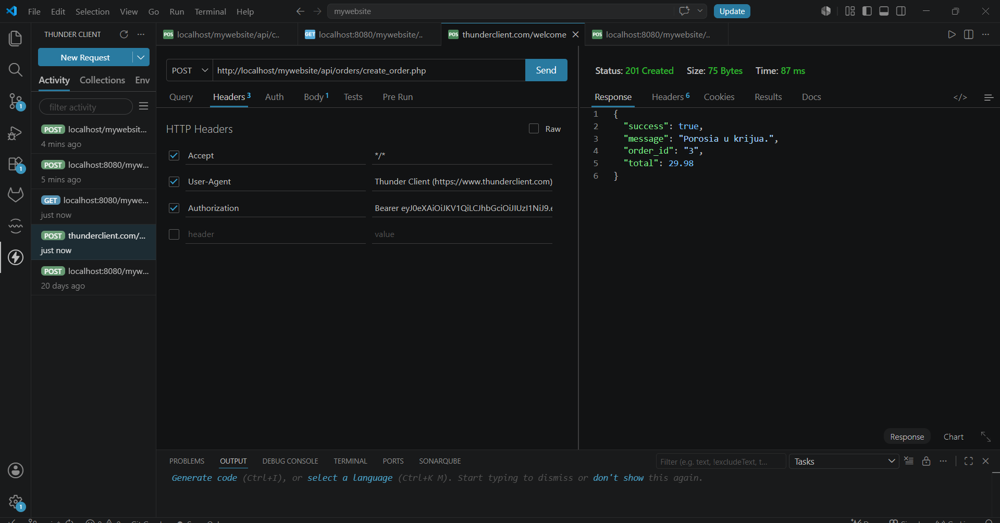
 
---
 
### TS-12 — Get Orders (Shikimi i porosive)
| Fusha | Detaji |
|---|---|
| Backend | GET /api/orders/get_orders.php — kthen të gjitha porositë e përdoruesit |
| Frontend | Liston porositë me status (Pending/Shipped) në UI |
| Statusi | Passed |
 
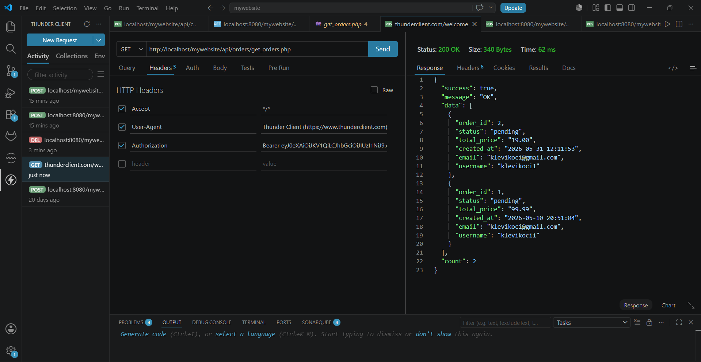
 
---
 
### TS-13 — Get Order Details (Detajet e porosisë)
| Fusha | Detaji |
|---|---|
| Backend | GET /api/orders/get_orders_details.php?order_id=X |
| Frontend | Shfaq listën e produkteve të blera dhe çmimet |
| Statusi | Passed |
 
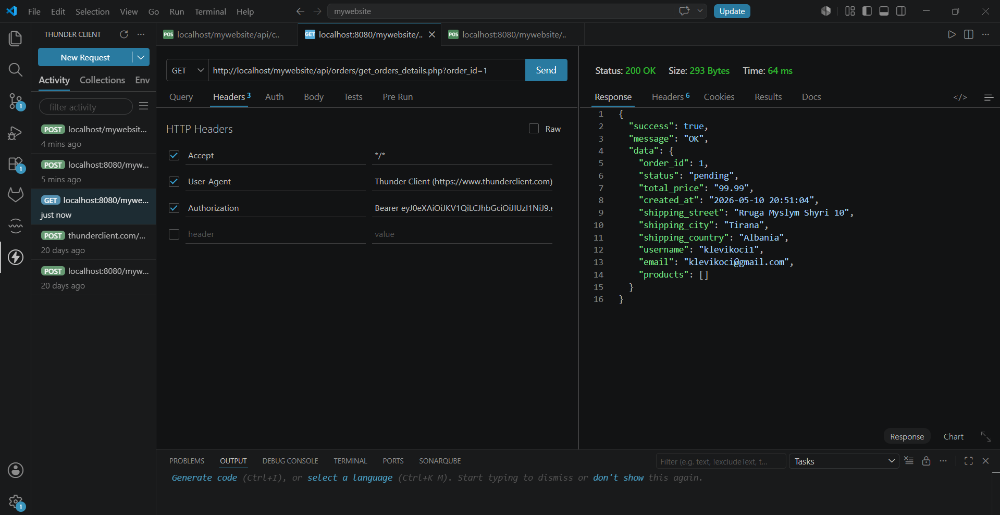
 
---
 
### TS-14 — Update Order Status (Anulimi/Përditësimi)
| Fusha | Detaji |
|---|---|
| Backend | PUT /api/orders/update_order.php — Ndryshon statusin në MySQL |
| Frontend | Butoni "Cancel" bëhet i padisponueshëm nëse statusi është 'Shipped' |
| Statusi | Passed |
 
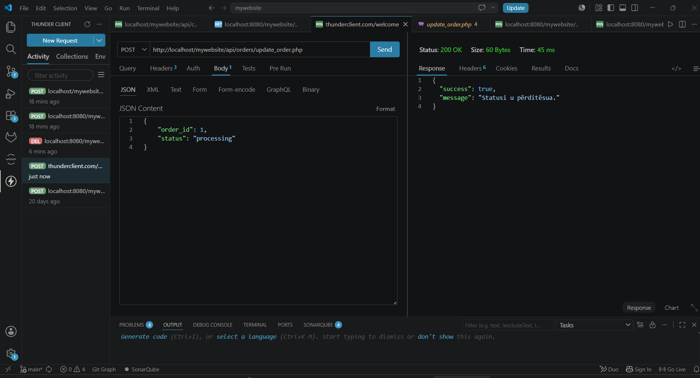
 
 
### TS-15 — Delete Order (Fshirja e porosisë)
| Fusha | Detaji |
|---|---|
| Backend | DELETE /api/orders/delete_order.php — fshin porosinë nga MySQL |
| Frontend | Porosia hiqet nga lista e porosive të përdoruesit |
| Statusi | Passed |
 
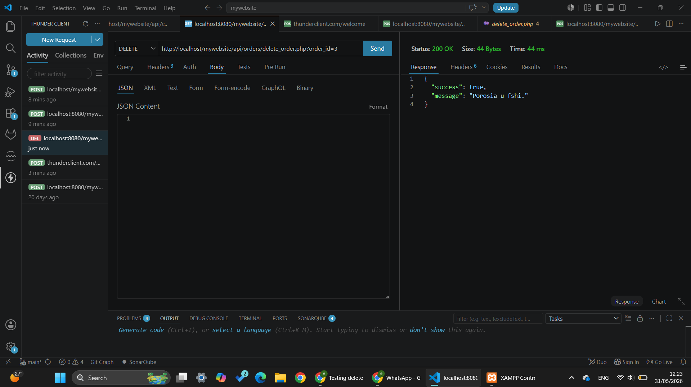

## Skenari 5: Menaxhimi i Profilit dhe Sigurisë së Llogarisë

### TS-16 — Get User (Marrja e të dhënave të profilit)
| Fusha | Detaji |
|---|---|
| Backend | GET /api/clients/get_user me JWT Token — kthen 200 OK |
| Frontend | Ngarkon emrin dhe email-in te faqja "Profili Im" |
| Statusi |  Passed |

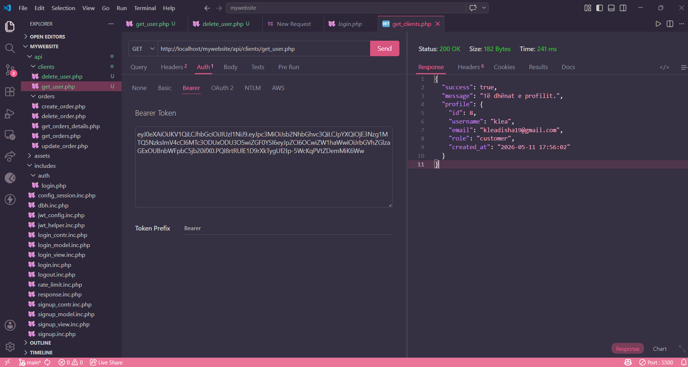

---

### TS-17 — Update Profile (Përditësimi i të dhënave)
| Fusha | Detaji |
|---|---|
| Backend | PUT /api/clients/update_user — përditëson në MySQL |
| Frontend | Shfaq "Profili u përditësua me sukses" |
| Statusi |  Passed |

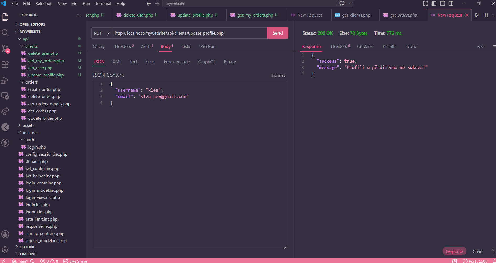

---

### TS-18 — Change Password (Ndryshimi i fjalëkalimit)
| Fusha | Detaji |
|---|---|
| Backend | Hash-on password-in e ri përpara ruajtjes në MySQL |
| Frontend | Nxjerr gabim nëse "Konfirmo fjalëkalimin" nuk përputhet |
| Statusi |  Passed |

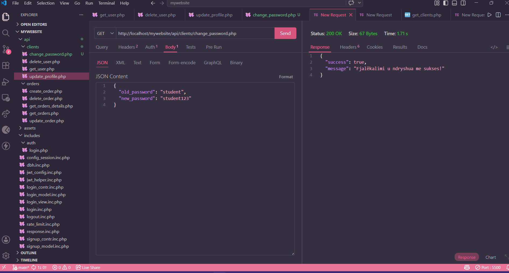

---

### TS-19 — Delete User (Fshirja e llogarisë)
| Fusha | Detaji |
|---|---|
| Backend | DELETE /api/clients/delete_user — kthen 200 OK |
| Frontend | Logout automatik, fshihet JWT nga LocalStorage, redirect te Homepage |
| Statusi |  Passed |

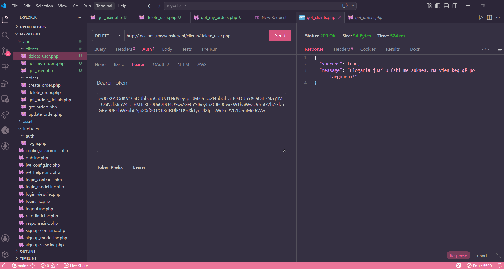

